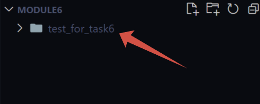
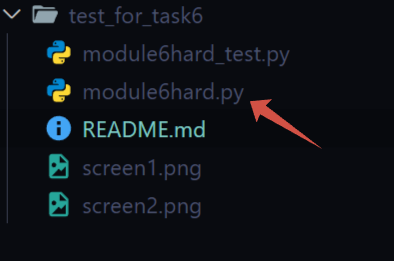

# Как использовать тест

1. Введите в терминале git clone https://github.com/RomTurino/test_for_task6.git
2. У вас появится папка "test_for_task6"
    
   
3. В эту папку поместите свой файл с финальным заданием по 6 модулю. Файл должен иметь название module6hard.py
    
   
4. Запустите файл module6hard_test.py